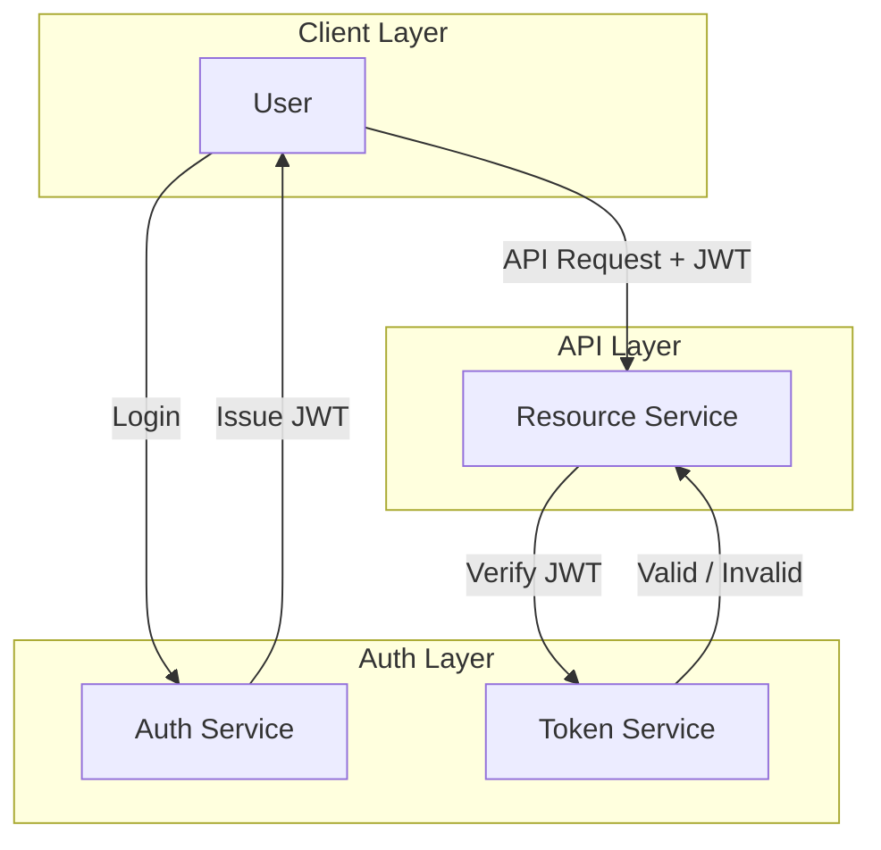

# Authentication

Our authentication system is designed to provide secure access to our API resources. It consists of an Auth Service responsible for handling user login and issuing JSON Web Tokens (JWTs), and a Token Service that verifies the validity of the JWTs when clients make API requests.

When a user logs in, the Auth Service authenticates their credentials and issues a JWT, which the user can then use to access protected resources. When the user makes an API request, they include the JWT in the request header. The Resource Server verifies the JWT with the Token Service to ensure that it is valid before granting access to the requested resource.



## Authentication Flow

1. The user sends a login request to the Auth Service with their credentials.
2. The Auth Service validates the credentials
   - If valid, it generates a JWT and sends it back to the user with the user data.
     - Go to step 3.
   - If invalid, it returns an authentication error.
     - Return to step 1.
3. The user includes the JWT in the header of subsequent API requests to the Resource Server.
4. The Resource Server extracts the JWT from the request header and sends it to the Token Service for verification.
5. The Token Service checks the validity of the JWT:
   - If the JWT is valid
     - Verifies the claims and permissions contained in the JWT.
     - If the claims and permissions are valid, it returns a success response to the Resource Server, which then grants access to the requested resource.
     - If the claims and permissions are invalid, it returns an error response to the Resource Server, which then returns an authorization error to the user.
   - If the JWT is invalid, it returns an error response to the Resource Server, which then returns an authentication error to the user.

## Security Considerations

- Ensure that JWTs are signed using a strong secret key and a secure algorithm (e.g., HS256 or RS256).
- Set appropriate expiration times for JWTs to minimize the risk of token theft.
- Implement token revocation mechanisms to invalidate JWTs when necessary (e.g., when a user logs out or when a token is compromised).
- Add Token refresh functionality to allow users to obtain new JWTs without re-authenticating, while still maintaining security.
- Use HTTPS to encrypt all communication between clients and the server to protect against man-in-the-middle attacks.
- Implement rate limiting and monitoring to detect and prevent brute-force attacks on the authentication endpoint.
- Consider implementing multi-factor authentication (MFA) for added security, especially for sensitive operations or high-privilege accounts.

## Conclusion

Our authentication system provides a robust and secure way for users to access our API resources. By using JWTs and following best practices for security, we can ensure that only authorized users can access protected resources while minimizing the risk of unauthorized access.

## User Model

```json
{
  "id": "bigint",
  "username": "string",
  "email": "string",
  "password_hash": "string", // Optional
  "full_name": "string",
  "pfp_url": "string",
  "google_id": "string", // Optional
  "permission_group": "bigint", // Reference to Permission Groups Model
  "createdAt": "timestamp",
  "updatedAt": "timestamp"
}
```

## Permission Groups Model

```json
{
  "id": "bigint",
  "name": "string",
  "permissions": ["string"], // e.g., ["read:users", "write:users"]
  "createdAt": "timestamp",
  "updatedAt": "timestamp"
}
```
